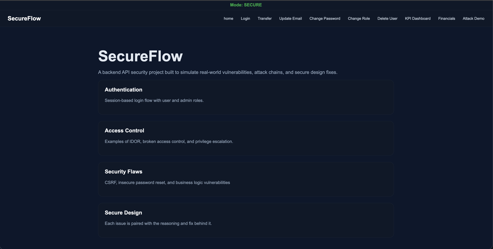
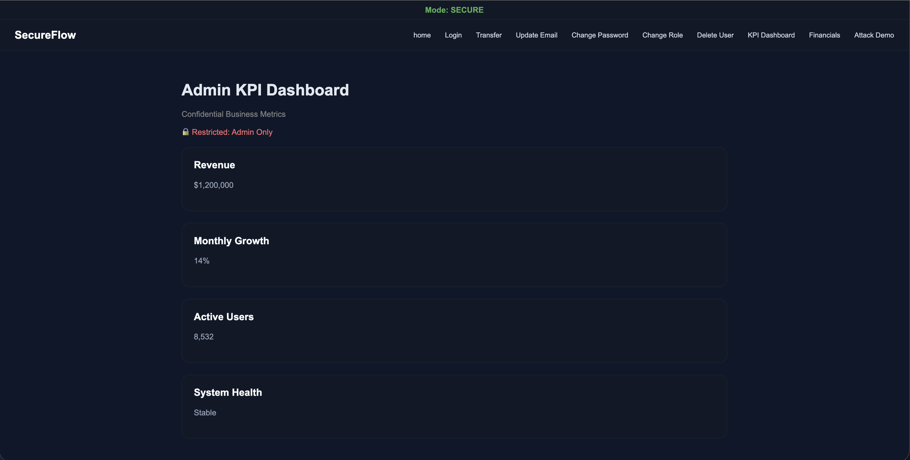
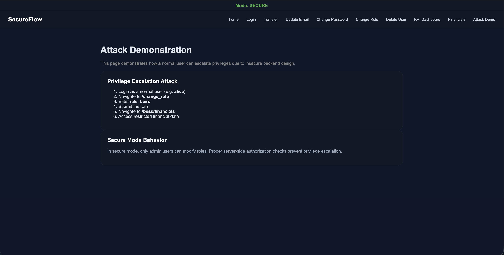

# SecureFlow - Backend Security Simulation Project

## Overview

SecureFlow is a backend-focused web application I built to simulate how real security vulnerabilities happen in a system.

This project focuses on how backend design decisions lead to real security vulnerabilities.

Instead of only learning what vulnerabilities like CSRF or IDOR are, I wanted to actually see how they appear during development and how small mistakes can turn into bigger security issues.

---

## Features

- Session-based authentication
- Role-based access control (user, admin, boss)
- Secure vs vulnerable modes
- Admin KPI dashboard (admin only)
- Boss financial page (boss only)
- Change role functionality to demonstrate privilege escalation
- Attack demo page to show how the system can be exploited

---

## Secure vs Vulnerable Mode

The system can run in two modes:

**Secure Mode**
- Proper authorization checks are enforced
- Users cannot access restricted pages
- Only admin can change roles

**Vulnerable Mode**
- The system trusts user input
- Users can change their own role
- This allows privilege escalation and access to restricted data

You can switch modes in `app.py` using the `MODE` variable.

---

## Demo Flow (Privilege Escalation)

In vulnerable mode:

1. Login as a normal user (for example, `alice`)
2. Go to `/change_role`
3. Change role to `boss`
4. Access `/boss/financials`

This shows how a normal user can escalate privileges and access sensitive data.

---

## Screenshots

### Home Page

### Admin KPI Dashboard

### Attack Demo

---

## Vulnerabilities I Explored

### CSRF - `/api/update_email`
The system allows a logged-in user's email to be changed without verifying if the request was actually made by the user.  
This means an attacker can trick the user into making this request.

### IDOR / Broken Access Control - `/api/get_user`
The API trusts user input (`user_id`) without checking permissions.  
This allows users to access data that does not belong to them.

### Missing Authentication - `/api/reset_password`
The password reset endpoint does not verify who is making the request.  
Anyone can reset any user's password using just an email.

### CSRF + Business Logic Flaw - `/admin/delete_user`
Admin actions can be triggered without verifying user intent.  
The system also allows deleting important users like the last admin, which can break the system.

---

## Example Attack Chain

One thing I focused on was how vulnerabilities can connect together:

- Use CSRF to change the victim’s email
- Trigger password reset
- Take over the account

This helped me understand how small issues can combine into a serious attack.

---

## What I Learned

- Authentication is not enough, authorization must also be enforced
- The system should not trust user input for access control
- Sensitive actions need protection, like CSRF tokens
- Security problems often come from system design, not just code

---

## How to Run

1. Clone the repository
2. Install dependencies
3. Run: python app.py
4. Open http://127.0.0.1:5000

---

### Tech Stack

- Python (Flask)
- HTML (Jinja templates)
- CSS